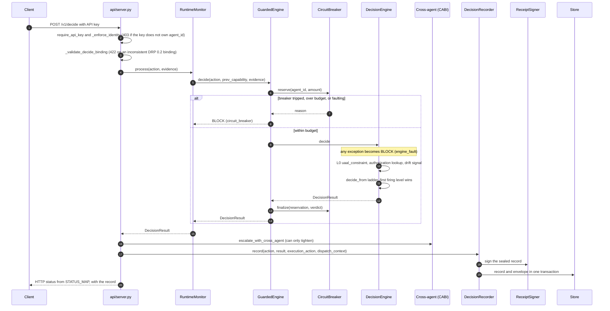

# Architecture

PrivateVault Agent DNA is a pre-execution decision runtime for AI agent
actions. Every action is decided **before** it runs, by a fixed precedence
ladder that fails closed, and every decision is sealed into a signed,
hash-chained record that a separate, stdlib-only verifier can check without
importing this codebase.

This file is the map for a new engineer. It is kept true by
`tests/test_architecture_doc.py`: every code reference below must resolve to
a real definition, and the precedence table must equal the pinned contract.
The module-level import graph is generated separately in
`docs/architecture/MAP.md` and enforced by `tests/test_architecture.py`.

## One decision, end to end

| Step | Code |
|---|---|
| HTTP entry | `api/server.py::decide` |
| API key to principal | `api/server.py::require_api_key` |
| Key must own the agent | `api/server.py::_enforce_identity` |
| DRP 0.2 binding checks | `api/server.py::_validate_decide_binding` |
| Per-agent monitor | `api/server.py::_monitor_for`, `agent_dna/runtime.py::RuntimeMonitor.process` |
| Breaker preflight | `agent_dna/circuit_breaker.py::GuardedEngine.decide`, `agent_dna/circuit_breaker.py::CircuitBreaker.reserve` |
| Fail-closed wrapper | `agent_dna/decision.py::DecisionEngine.decide` |
| L0 and authorization lookup | `agent_dna/decision.py::DecisionEngine._decide_unsafe` |
| Precedence ladder | `agent_dna/decision.py::DecisionEngine.decide_from` |
| Cross-agent escalation | `agent_dna/connector/cross_agent.py::escalate_with_cross_agent` |
| Seal, sign, persist | `agent_dna/decision_recorder.py::DecisionRecorder.record` |
| Record formats | `agent_dna/decision_record.py::build_record` (drp/0.1, audit-only), `agent_dna/decision_record.py::build_record_v02` (drp/0.2, bound) |
| Signature | `agent_dna/signer_bridge.py::ReceiptSigner.sign_record` |
| Restart recovery | `agent_dna/decision_recorder.py::DecisionRecorder.restore_chains` |
| Wiring of all of the above | `agent_dna/composition.py::build_production_runtime` |

## Precedence ladder

Authoritative source: `spec/contracts/precedence-order.json`. Evaluation is
strictly in ascending order; the first level that fires ends evaluation; a
BLOCK is final. Only `drift` is probabilistic.

<!-- precedence:begin -->
| Order | Level | Class | On violation | Meaning |
|---|---|---|---|---|
| 0 | `uaal_constraint` | deterministic | block | Enterprise constraints checked against caller-supplied state |
| 1 | `invariant` | deterministic | block | Forbidden capabilities and transition constraints |
| 2 | `policy` | deterministic | data_driven | Customer rules or OPA; the matched rule declares block or require_approval |
| 3 | `consensus` | deterministic | require_approval | Multi-agent quorum, evidence-gated |
| 4 | `authorization` | deterministic | require_approval | Capability grants: expiry, revocation, budget |
| 5 | `economics` | deterministic | require_approval | Cost anomaly and ROI floor |
| 6 | `drift` | probabilistic | require_approval | Learned behavioral drift |
| 7 | `baseline` | deterministic | allow | No prior level fired |
<!-- precedence:end -->

Outside the ladder: the circuit breaker runs **before** it
(`agent_dna/circuit_breaker.py::GuardedEngine.decide`), any exception inside
it becomes BLOCK `engine_fault`, and cross-agent escalation runs **after** it
and can only tighten a verdict.

## Trust boundaries

| Boundary | Enforced by | Failure mode |
|---|---|---|
| Caller identity | `api/server.py::require_api_key`, `api/server.py::_enforce_identity` | 401 / 403, nothing recorded |
| Budget and swarm limits | `agent_dna/circuit_breaker.py::CircuitBreaker.reserve`; groups loaded by `agent_dna/composition.py::_load_breaker_groups` | BLOCK `circuit_breaker`; malformed config refuses startup |
| Engine faults | `agent_dna/decision.py::DecisionEngine.decide` | BLOCK `engine_fault`, never ALLOW |
| Capability grants | `agent_dna/grants.py::GrantRegistry` | require_approval |
| Maker is not checker | `agent_dna/multi_agent/dual_control.py::is_initiate_intent`, `agent_dna/connector/cross_agent.py::escalate_with_cross_agent` | escalate only |
| Execution permit | `api/server.py::authorize` (POST /v1/authorize) | refuses mint without a stored, bound ALLOW |
| Suspension at dispatch | `agent_dna/sqlite_store.py::SQLiteDecisionStore.try_consume_unless_suspended`, `agent_dna/connector/adapters/exact_byte_http.py::ExactByteHttpDispatcher._consume` | DISPATCH_SUSPENDED; nothing sent, permit not burned |
| Evidence integrity | `agent_dna/decision_recorder.py::DecisionRecorder.record` | record and envelope commit together or not at all |
| Independent verification | `tools/verify_records.py` (stdlib; never imports `agent_dna`) | tamper, deletion, divergence reported |
| Python to Rust | only `agent_dna/signer_bridge.py` imports `pv_runtime` | enforced by `tests/test_architecture.py` |

## Where things live

| Path | Responsibility |
|---|---|
| `api/` | FastAPI decision service |
| `agent_dna/` | Runtime core: engine, records, recorder, signer, breaker, composition |
| `agent_dna/gateway/` | Inline MCP gateway: framing, protocol, upstream, egress |
| `agent_dna/connector/` | Connector middleware, MCP and exact-byte HTTP adapters, cross-agent enforcement |
| `agent_dna/multi_agent/` | Cross-agent invariants, dual control, interaction graph |
| `agent_dna/consensus/` | Signed, trust-weighted and Byzantine quorum |
| `agent_dna/policy/`, `agent_dna/adapters_policy/` | Customer policy checker and loaders (local, OPA, skill) |
| `agent_dna/scan/` | Offline log ingest and replay |
| `rust/` | `pv_runtime`: Rust mirror of records and signer, byte-parity with Python |
| `spec/` | Wire contracts, schemas, canonical test vectors |
| `tools/` | Independent verifiers, parity check, benchmarks, `tools/archmap.py` |
| `experimental/` | Quarantined research; not shipped in the wheel or image |
| `docs/adr/` | Architecture decisions, numbered |

## Changing the architecture

1. Write or update an ADR in `docs/adr/`.
2. Make the change with a failing test first and a negative control.
3. Run `python tools/archmap.py` if imports changed; commit the regenerated map.
4. If a precedence level changes, update `spec/contracts/precedence-order.json`,
   the ladder table above, and the engine together; three tests will fail until
   all three agree.
5. State anything you cannot prove in `docs/WHAT-WE-DO-NOT-CLAIM.md`.
