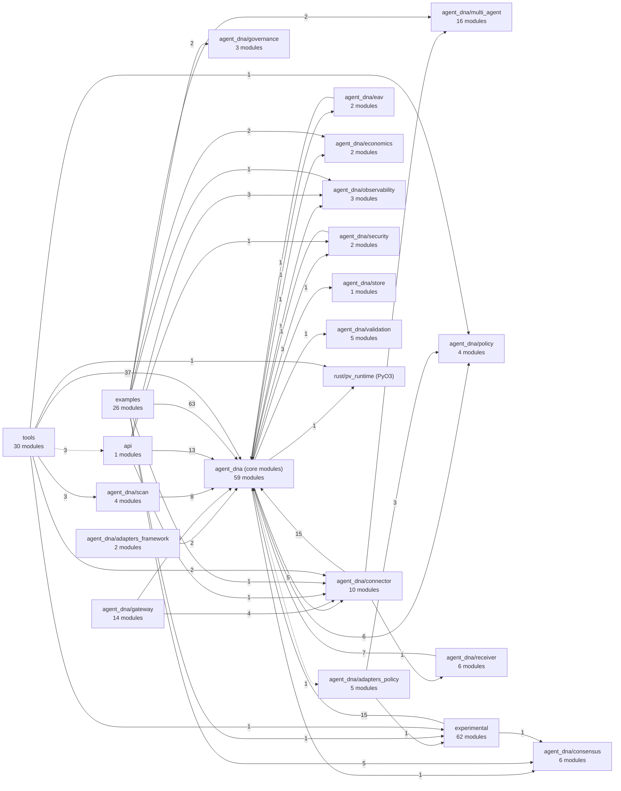

# Architecture map (generated)

<!-- GENERATED by tools/archmap.py. Do not edit. Regenerate: python tools/archmap.py -->

Nodes are directories; numbers are module counts. Solid arrow: imported at import time. Dashed: only lazy imports (inside functions). Label: number of module-to-module imports.

## Directories

| Directory | Modules | Lines |
|---|---:|---:|
| `experimental` | 62 |
| `agent_dna (core modules)` | 59 |
| `tools` | 30 |
| `examples` | 26 |
| `agent_dna/multi_agent` | 16 |
| `agent_dna/gateway` | 14 |
| `agent_dna/connector` | 10 |
| `agent_dna/consensus` | 6 |
| `agent_dna/receiver` | 6 |
| `agent_dna/adapters_policy` | 5 |
| `agent_dna/validation` | 5 |
| `agent_dna/policy` | 4 |
| `agent_dna/scan` | 4 |
| `agent_dna/governance` | 3 |
| `agent_dna/observability` | 3 |
| `agent_dna/adapters_framework` | 2 |
| `agent_dna/eav` | 2 |
| `agent_dna/economics` | 2 |
| `agent_dna/security` | 2 |
| `agent_dna/store` | 1 |
| `api` | 1 |

## Hubs (highest fan-in: changes here ripple furthest)

| Module | Imported by | Imports |
|---|---:|---:|
| `agent_dna.authority_v01` | 37 | 0 |
| `agent_dna.trace` | 25 | 0 |
| `agent_dna.decision` | 22 | 5 |
| `agent_dna` | 21 | 21 |
| `agent_dna.multi_agent.interaction_graph` | 14 | 1 |
| `agent_dna.execution_v01` | 13 | 4 |
| `agent_dna.multi_agent.base` | 13 | 1 |
| `agent_dna.adapters` | 11 | 1 |
| `agent_dna.gateway.errors` | 11 | 0 |
| `agent_dna.advisory` | 9 | 0 |
| `agent_dna.apikeys` | 9 | 0 |
| `agent_dna.decision_recorder` | 7 | 5 |
| `agent_dna.gateway.framing` | 7 | 4 |
| `agent_dna.manifold` | 7 | 1 |
| `agent_dna.runtime` | 7 | 5 |

## Import-time cycles

None.

## Core → experimental imports

- `agent_dna.adapters_policy.git_bundle -> experimental.adapters.git_bundle (top)`

## Rust bridge (modules importing `pv_runtime`)

- `agent_dna.signer_bridge`
- `tools.rust_parity_check`
